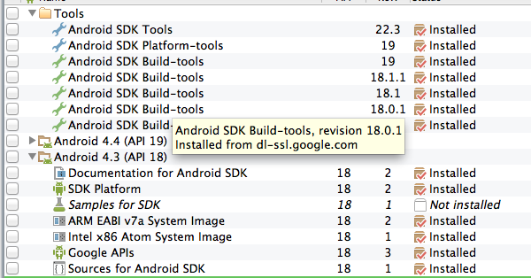
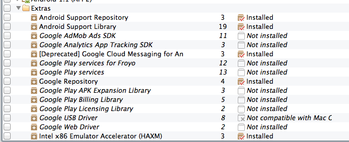

Android Chromium
=====================
# Table Of Contents
* [Introduction](https://github.com/davisford/android-chromium-view#introduction)
* [The Why](https://github.com/davisford/android-chromium-view#why)
* [Difference Between This & ChromeView](https://github.com/davisford/android-chromium-view#what-is-the-difference-between-this--chromeview)
* [What Do I Do With This](https://github.com/davisford/android-chromium-view#what-do-i-do-with-this)
* [Artifacts: Assets & Libraries](https://github.com/davisford/android-chromium-view#artifacts-assets--libraries)
* [Gradle Support](https://github.com/davisford/android-chromium-view#gradle-support)
* [Updating Chromium](https://github.com/davisford/android-chromium-view#updating-chromium)
* [License](https://github.com/davisford/android-chromium-view#license)
* [What Version Of Chromium Is It?](https://github.com/davisford/android-chromium-view#what-version-of-chromium-is-it)
* [Pre-requisites For Building Chromium](https://github.com/davisford/android-chromium-view#pre-requisites-for-building-chromium)
* [Debugging](https://github.com/davisford/android-chromium-view#debugging)
  * [Java](https://github.com/davisford/android-chromium-view#java)
  * [Remote Chrome DevTools](https://github.com/davisford/android-chromium-view#remote-chrome-devtools)
  * [GDB](https://github.com/davisford/android-chromium-view#gdb)
* [Pull Requests](https://github.com/davisford/android-chromium-view#pull-requests)
* [Invaluable Resources](https://github.com/davisford/android-chromium-view#invaluable-resources)

# Introduction

This project was inspired by [pwnall's chromeview](https://github.com/pwnall/chromeview), but it shares no common code.  The goal of this project is similar to that project -- which is to allow you to embed a replacement for the stock [Android WebView](https://developer.android.com/reference/android/webkit/WebView.html), using the latest [Chromium](http://www.chromium.org/Home).

## Why

* Android WebView does not have the same performance characteristics as Chromium (the latter is faster)
* Android WebView lacks feature parity with Chromium.  The Chromium team moves fast, it is usually one of the first browsers to receive new W3C features, etc.
* Android WebView is embedded and tied to the platform -- updating it therefore becomes problematic since you have to update the whole platform to update the browser

**NOTE**: Google recently announced that they will be using [Chromium for the Android WebView in release 4.4 KitKat](http://blog.chromium.org/2013/11/introducing-chromium-powered-android.html).  While that is great news for web developers who want to build apps on the Android platform, there may be still be valid reasons why you'd prefer to go down a path like this:

* You'd like more control over the browser; perhaps you'd like to add customizations or integrations that don't exist in the stock browser
* You'd like to support a better web experience for your app on pre-KitKat devices
* You want the bleeding edge and don't wish to wait for a platform update to push out a new browser for your app(s)

## What Is The Difference Between This & ChromeView
The [chromeview](https://github.com/pwnall/chromeview) project was an awesome start to solving this problem, and I started there, but henceforth, the author has stated that he lacks the time to dedicate to it.  So, I originally [forked](http://github.com/davisford/chromeview) it, and updated Chromium to a newer build.  Then I looked into the [scrolling issues](https://github.com/pwnall/chromeview/pull/6) and after some digging, decided that there was a separate build artifact (`Content Shell`) out of Chromium that would provide a better base than the one chromeview was currently using.  The code was different enough that I felt it just warranted a separate repo -- so that's what you have here.  Scrolling does work great here.  There are some quirks, so check the [issues](https://github.com/davisford/android-chromium/issues?state=open) to figure out what isn't quite working (yet).

Later, I realized that the Chromium TestShell was another build artifact that includes everying in Content Shell, and also includes various Google Chrome features like sync, autofill, infobar, tabs, cache invalidation, etc.  So, I decided to add a target for Chromium Test Shell and allow you to choose to build one or both, at your convenience.  I also re-factored the whole thing to use Gradle with the [Android Gradle plugin](http://tools.android.com/tech-docs/new-build-system/user-guide).  It works happily with [Android Studio](https://developer.android.com/sdk/installing/studio.html).

## What Do I Do With This

### Pre-requisites
Install [Android Studio](https://developer.android.com/sdk/installing/studio.html).  This is the easiest way to get the Android Build Tools and SDK needed for the build.  Launch the SDK Manager from inside Android Studio (`Tools -> Android -> SDK Manager`) and configure it so it matches _at least_ the following:





These versions may be outdated.  You need to cross-reference the versions found in `dependencies.gradle` to ascertain what version of the SDK the build expects, as well as what version of the build tools.  You'll also need the extra repositories denoted in the `Extras` section of the SDK Manager.

### Build / Install

Run `gradlew build` (Mac / Linux) or `gradlew.bat build` (Windows)

Artifacts are found under `${projectDir}/build/apk`.  Note that only `content-shell` and `testshell` will build an apk.  The rest are defined as library projects.

You can also use Gradle to build and install the app with adb.  Connect a device or emulator and run:

For Content Shell:

```sh
$ ./gradlew installDebug chromium:content-shell
```

For Test Shell:

```sh
$ ./gradlew installDebug chromium:testshell
```

Both apps provide a very basic stock browser shell with only an address bar and a back/forward button, but take solace in the fact that the underpinnings are full Chromium.  You can use this as a baseline to build a new browser, or an app that uses the browser, or something more interesting.

I have checked in the Intellij `.iml` files, so you can just import the project directly into Android Studio.

## Artifacts: Assets & Libraries
The main Chromium artifact is a native shared library `.so`.  It also depends on a number of `.pak` files in the `/assets` folder (you'll find these in the `content-shell` and `testshell` apps).  As built, these need to be included in your `/libs` and `/assets` folder of your project, and they *will* add a good 30-40MB of binary goodness to the size of your app.  However, if you're savvy, you could figure out a way to load those from a central location on the platform, so they don't have to be included in `.apk` file.  This will require code modifications.

This project contains a snapshot in time binary build of Chromium for Android -- the specific version that was built is captured in the [VERSION file](http://example.com).   Instructions below if you want to update Chromium.

The rest of the projects include java source and Android assets that were authored by Google to get Chromium to show up in a standard Android view and interact with it.

# Updating Chromium

Build the latest Chromium for Android (see instructions below).  A shell script is included under `chromium/update-chromium` that can be used to copy over new Chromium source and build artifacts.  Very minor modifications were made to the source in order to re-structure it into the new build or get around minor issues.  Modifications are kept in each project's `modified` directory (if it doesn't have one, nothing was modified).  If you run the shell scripts, *beware it will delete and replace your source*.  If you don't want this, don't run it blindly -- edit it to suit your needs.  My workflow (which isn't ideal) is to run the script, and then hand-merge the couple of files in the `modified` directory.

Google updates this code constantly, so if you `git pull` (or `gclient sync` in Chromium-ese) on Chromium repo and rebuild, then copy the stuff over here, there's no guarantee that all of this won't break.  Note that the Java source is pretty tightly coupled to the native code -- so if you build a new shared object, chances are you'll need all the latest `.java` too, or it will blow up at runtime.

## License
Nearly all of the source in here is copied from the Chromium project and thus subject to Chromium license(s) -- `LICENSE` files are found w/in each project.  Anything else is licensed under BSD, found in the root project dir `LICENSE` file.

## What Version of Chromium Is It?

Inspect the [VERSION file](http://example.com) for details on last commit logs

# Pre-requisites for Building Chromium
@pwnall has some [nice instructions](https://github.com/pwnall/chromeview/blob/master/crbuild/vm-build.md) for how to setup a Chromium build machine on a VM.  I have made a [couple of tweaks to it on my own fork](https://github.com/davisford/chromeview/blob/master/crbuild/vm-build.md) -- namely stick with Ubuntu 12.04 for the least amount of headache.

I build on a MBP using an Ubuntu 12.04 image I created in VMWare Fusion.  You will need some decent hardware to build Chromium.  On 4 cores with 4GB RAM it can take several hours to complete the build.  If you have a single core, forget it.

If you have a spare machine to setup a build machine, I suppose that would be even nicer.

# Debugging

## Java
You can debug `content-shell` or `testshell` Java straight from Android Studio by running one of the gradle tasks in debug mode.

## Remote Chrome DevTools

Yes, you can :)  You need a fairly recent copy of Google Chrome running on your dev machine along with the ADT bundle.

*TODO*: these instructions work for `content-shell`, but `testshell` is going to be slightly different; need to add section on how to debug `testshell`.

First, remote shell into the device and add the command line switch to enable remote debug over USB:

```shell
$ adb shell
shell@android:/ $
```

Content shell will read the file `/data/local/tmp/content-shell-command-line` at startup and apply whatever valid [switches](http://peter.sh/experiments/chromium-command-line-switches/) it finds.  You can quickly create this file with the remote usb debug switch as follows:

```shell
shell@android:/ $ echo chrome --remote-debugging-raw-usb > /data/local/tmp/content-shell-command-line
```

Connect your device with USB, and use ADT (or Gradle or command line tools, etc.) to start the `content-shell` Android application.  Now, you need to setup adb port forwarding for the debug protocol.  Execute this on your dev machine (not on the device itself):

```shell
$ adb forward tcp:9222 localabstract:content_shell_devtools_remote
```

Now, you can navigate to http://localhost:9222 using Chrome on your dev machine, and you should see the instance of `content_shell` -- you can inspect it and it will open up DevTools and allow you to remote debug.

## GDB
You need root on your device.  Specifically, if the command `adb root` works for you, you're in good shape.  If not, you won't be able to debug native code.  You'll also need to have built Chromium yourself (easiest way), as Google provides a [suite of adb + gdb scripts](https://code.google.com/p/chromium/codesearch#chromium/src/build/android/&q=adb_gd&sq=package:chromium) that do all the heavy lifting for you to attach gdb over adb.

Consult those scripts for making this work.  It would be nice to modify a version of those scripts to work with the build in this repo, but that is a task for another day (happy to take a pull request for this).

# Pull Requests

Pull requests welcome to help improve the environment / shell scripts / build scripts.  In Android, the project's namespace is important, and if you have multiple package namespaces with resources, then it becomes a PITA to resolve the `R.java` files.  This is why I broke it out (one project per namespace) -- to avoid this problem.  Some of the projects don't contain any resources, however, and they could really be merged into a single library, but I left them separate, as you never know if Google decides to add resources to a project, then this structure already works and requires no re-factoring.

Don't send pull requests for Google authored code b/c it will just be re-written on the next update -- unless you think it warrants saving -- in that case commit a copy of it to the `modified` sub directory of said project.  Don't send pull requests for updates to Chromium, I'd prefer you just fork the repo and update those yourself.

# Invaluable Resources

* [Chromium Commit Log](https://chromium.googlesource.com/chromium/chromium/+log/trunk/chrome)
* [Online Chromium Code Search](https://code.google.com/p/chromium/codesearch) - I use this a lot.
* [Chromium For Developers Docs](http://dev.chromium.org/developers) - best start reading if you want to really get into this
* [Chromium For Android Build Instructions](https://code.google.com/p/chromium/wiki/AndroidBuildInstructions) - instructions and scripts provided by @pwnall in [chromeview](https://github.com/davisford/chromeview/tree/master/crbuild) parse this down, but I'm just dropping this here for reference
* [Android WebView Talk At Google I/O 2012](https://developers.google.com/events/io/2012/sessions/gooio2012/122/) - might prove useful for some background info

